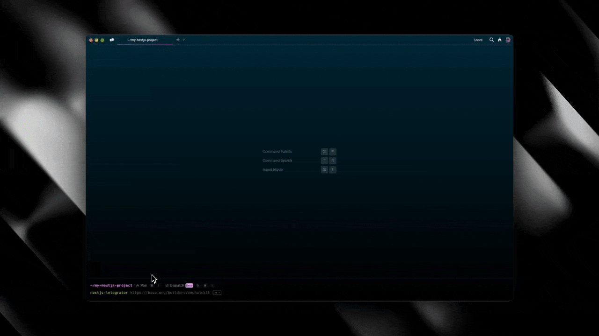

# Next.js Tool Integrator

[](https://badge.fury.io/js/nextjs-tool-integrator)
[](src/public/Integrator-Demo.gif)

A CLI tool that bootstraps or integrates a full-stack Next.js application with an external tool based on a provided URL.

## Features

- Bootstraps a new Next.js application if one doesn't exist
- Integrates external tools into existing Next.js applications
- Uses Stagehand for browser automation to analyze and interact with external tools
- Generates API endpoints, utility functions, and UI components for the integrated tool

## Installation

### Global Installation

```bash
npm install -g nextjs-tool-integrator
```

### Local Installation

```bash
npm install nextjs-tool-integrator
```

## Usage

### Command Line

```bash
# Global installation
nextjs-integrator <url>

# Local installation
npx nextjs-integrator <url>
```

### Options

- `-f, --force`: Force integration even if Next.js app is not detected

### Examples

```bash
# Bootstrap a new Next.js app and integrate with an external tool
nextjs-integrator https://example-tool.com

# Integrate with an external tool in an existing Next.js app
cd my-nextjs-app
nextjs-integrator https://example-tool.com

# Force integration even if Next.js app is not detected
nextjs-integrator https://example-tool.com --force
```

## How It Works

1. **Detection**: The tool first checks if a Next.js application exists in the current directory.
2. **Bootstrapping**: If no Next.js app is detected, it bootstraps a new full-stack Next.js application.
3. **Analysis**: The tool uses Stagehand to analyze the provided URL and extract information about the external tool.
4. **Integration**: Based on the analysis, it generates the necessary code to integrate with the external tool:
   - API endpoints
   - Utility functions
   - UI components
   - Environment variables
   - Stagehand automation scripts

## Integration Components

When integrating an external tool, the following components are created:

- **API Endpoint**: `/api/[tool-name]` with GET and POST handlers
- **Integration Library**: `/src/lib/integrations/[tool-name]` with utility functions
- **UI Components**: `/src/components/[tool-name]` with a widget component
- **Demo Page**: `/[tool-name]` to showcase the integration
- **Environment Variables**: Added to `.env.local` and `.env.example`
- **Stagehand Automation**: Scripts for browser automation with the tool

## Development

### Prerequisites

- Node.js 18 or higher
- npm 8 or higher

### Setup

```bash
# Clone the repository
git clone https://github.com/yourusername/nextjs-tool-integrator.git
cd nextjs-tool-integrator

# Install dependencies
npm install

# Build the project
npm run build

# Link for local development
npm link
```

### Scripts

- `npm run build`: Build the TypeScript code
- `npm run dev`: Run the CLI in development mode
- `npm run lint`: Run TypeScript type checking
- `npm start`: Run the built CLI
- `npm run prepublishOnly`: Prepare the package for publishing

### Publishing to npm

To publish the package to npm, follow these steps:

1. Make sure you have an npm account and are logged in:
   ```bash
   npm login
   ```

2. Update the version number in package.json:
   ```bash
   npm version patch  # For bug fixes
   npm version minor  # For new features
   npm version major  # For breaking changes
   ```

3. Publish the package:
   ```bash
   npm publish
   ```

4. If you want to publish a beta version:
   ```bash
   npm version prerelease --preid=beta
   npm publish --tag beta
   ```

## License

ISC
